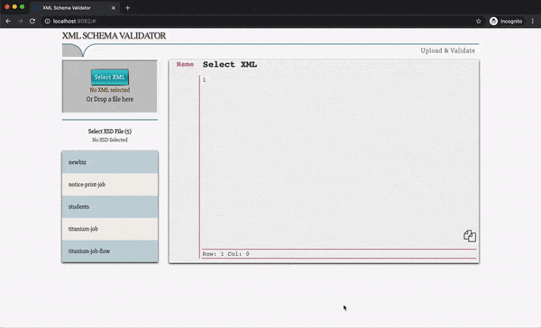

# xml-schema-validator
Dockerised Front end and backend code for validating xml against xsd

- Many of us don't want to pay for license to XMLSpy
- Using Notepad++ to validate is tedious
- We can use online tools, but its not recommended to copy content into internet especially when the data is sensitive
- As a team, all of us need to maintain the list of XSD files 

So this can be used as an internal tool without any hassle

